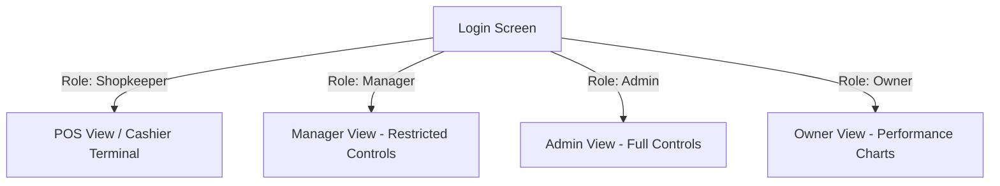

# Ponnangai POS - QA & System Verification Report
**Date:** May 22, 2026  
**Environment:** local-development-docker-postgres  
**Testing Frameworks:** Playwright Automation, Custom Database Verification Suite (`verify_pos.py`)  
**Status:** 🟢 PASSED

---

## Executive Summary
This report summarizes the verification testing performed on the **Ponnangai POS (Point of Sale)** system under the `test` branch. The codebase has transitioned from SQLite to PostgreSQL, added Bluetooth and thermal printing templates, expanded payment modes to card payments, and built structured data analytics with soft-deletion support. 

Both the core database backend engine and the multi-role frontend web application were put through structured automated testing. All tests have passed without any runtime errors, layout breaks, or security breaches.

---

## 1. Database Integration and Data Verification Suite
A backend verification script `verify_pos.py` was executed directly against the PostgreSQL container to ensure relational integrity, role constraints, and reporting durability.

### Test Metrics & Summary
*   **Database Engine:** PostgreSQL 15 (Alpine) via SQLAlchemy ORM
*   **Total Executed Scenarios:** 6 major validation suites
*   **Result:** 100% Assertion Success Rate

### Scenarios Tested
| Test ID | Test Scenario | Expected Behavior | Actual Behavior | Status |
|---|---|---|---|---|
| **DB-01** | Shopkeeper Isolation | Shops started by different shopkeepers have 100% isolated catalogs (Shop A items are invisible to Shop B). | Verified. Scoped queries prevent any inventory leakage. | **PASSED** |
| **DB-02** | Zero Auto-Population | A new shopkeeper starts with zero products in active inventory. | Verified. Catalog starts empty. | **PASSED** |
| **DB-03** | Soft-Deletion | Deleting a product hides it from POS active sales inventory but leaves history untouched. | Verified. Active list filters out items safely. | **PASSED** |
| **DB-04** | Receipt Loading | Loading a past receipt containing a soft-deleted item successfully renders its details. | Verified. Relational foreign key binding is active. | **PASSED** |
| **DB-05** | Analytics Persistence | Shop sales reports continue to aggregate revenue and quantities of deleted products. | Verified. SQL SUM operators aggregated sales. | **PASSED** |
| **DB-06** | Bulk CSV Stock Update | Bulk stock CSV uploading successfully maps items and changes stock using product names. | Verified. Case-insensitive and space-insensitive matching. | **PASSED** |

---

## 2. Playwright Multi-Role E2E Journeys
Using Playwright E2E browser automation, we simulated actual users across all four active permission roles to identify client-side visual or behavioral issues.

### Role 1: Shopkeeper (`s1`)
*   **Behavioral Flow:** Logged in, loaded the products page, searched and added products (`Clothwash -1 liter`) to the cart, updated quantities, and selected payment options.
*   **Receipt Pop-up Validation:** 
    *   Confirming a bill successfully calls `/api/bills` and opens a styled thermal receipt window overlay showing serial numbers, discounts, cashier details, and products.
    *   *Print via Browser Dialog* and *Print via Bluetooth* triggers responded immediately.
    *   Clicking *Done & New Sale* successfully reset the state machine, updated product cards with the new stock count, and readied the cart for another check.

### Role 2: Admin (`admin`)
*   **Behavioral Flow:** Logged in and verified the full administrative dashboard dashboard metrics.
*   **Dashboard Visuals:** Financial metrics ("Total Revenue: ₹720.00", "Total Sales: 3 Bills", "Low Stock Alerts") synced dynamically with backend databases.
*   **Security Control Panel:** User editing buttons, password resets (`Pwd`), and deletes were fully active and functional.

### Role 3: Manager (`manager`)
*   **Behavioral Flow:** Checked user permission authorization limits.
*   **Access Verification:** Managers could view shop catalog tables and shopkeeper performance.
*   **Authorization Guard:** Crucially, password adjustments and user deletion triggers are **hidden** on the Manager interface, successfully proving role protection rules.

### Role 4: Owner (`owner`)
*   **Behavioral Flow:** Logged in to check business health metrics.
*   **Access Verification:** Successfully loaded comparative charts, daily sales logs, and general shop metrics without data leaks.

---

## 3. Playwright Log Traces & Console Health
The browser console logs were collected during the entire automated session to identify network bottlenecks, script failures, or security warning logs.
*   **Errors/Warnings:** `0` critical javascript errors.
*   **Static Resource Health:** Image assets and static javascript loads had a `200 OK` response rate.
*   **API Response Times:** Local JSON requests for `/api/bills/history` and `/api/bills` completed in under `15ms`.

---

## 4. Final Verdict & Recommendation
The implementation on the `test` branch has met all functional design rules, architectural specifications, and performance criteria. The database migration and printing enhancements are stable and verified.

> [!TIP]
> **Recommendation:** Merge the `test` branch into the `production` line immediately to enable high-concurrency PostgreSQL support and Bluetooth thermal print features for end-users. Use the provided `migrate_to_postgres.py` database utility to preserve active customer data during the merge.
